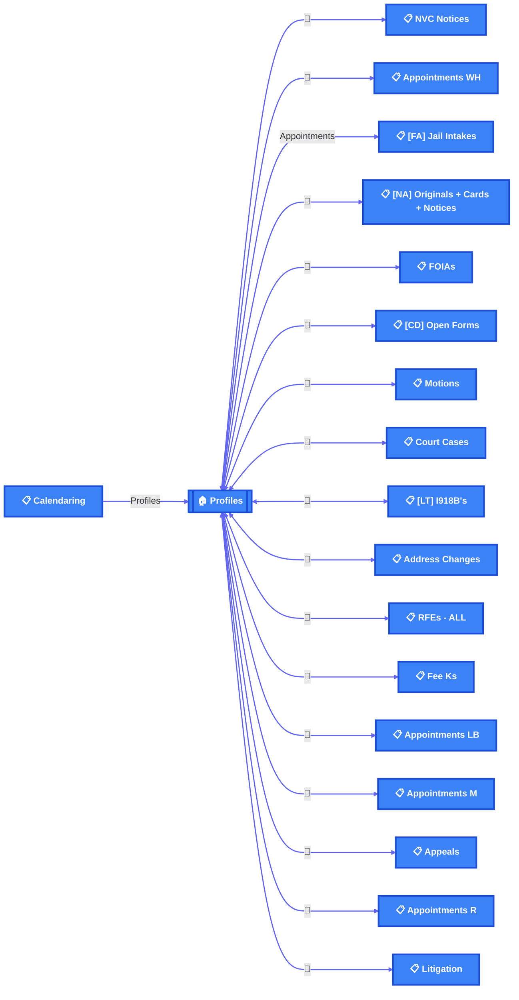

# 🗺️ Board Relationship Map

> 📅 Last updated: Sunday, March 8, 2026

## 📊 Overview

| Metric | Value |
|--------|-------|
| 📋 Total Boards | 19 |
| 🔗 Connections | 126 |
| ↔️ Bidirectional | 33 |
| 🪞 Mirror Columns | 196 |

**🏠 Central Hub:** Profiles

---

## 🧠 Mental Map

*Clean hierarchical view with main board at top*

```mermaid
flowchart TB

  %% Styling
  classDef default fill:#F5A623,stroke:#000,stroke-width:1px,color:#000,font-weight:bold
  classDef main fill:#F5A623,stroke:#000,stroke-width:2px,color:#000,font-weight:bold,font-size:18px

  board_8025265377["PROFILES"]:::main

  board_18392490403["NVC Notices"]
  board_9283837796["Appointments WH"]
  board_8094412694["[FA] Jail Intakes"]
  board_8025618300["[NA] Originals + Cards + Notices"]
  board_8025590516["FOIAs"]
  board_8025566986["[CD] Open Forms"]
  board_8025556892["Motions"]
  board_8025546360["Court Cases"]
  board_8025538497["[LT] I918B's"]
  board_8025531784["Address Changes"]
  board_8025524218["RFEs - ALL"]
  board_8025467270["Fee Ks"]
  board_8025389724["Appointments LB"]
  board_8025383981["Appointments M"]
  board_3473957885["Appeals"]
  board_7788520205["Appointments R"]
  board_4299007012["Litigation"]
  board_9287895872["Calendaring"]

  board_8025265377 --> board_7788520205
  board_8025265377 --> board_8025383981
  board_8025265377 --> board_8025389724
  board_8025265377 --> board_8094412694
  board_8025265377 --> board_9283837796
  board_8025265377 --> board_8025467270
  board_8025265377 --> board_7788520194
  board_8025265377 --> board_18392565355
  board_8025265377 --> board_6775627168
  board_8025265377 --> board_8025524218
  board_8025265377 --> board_8025538497
  board_8025265377 --> board_8025546360
  board_8025265377 --> board_8025556892
  board_8025265377 --> board_8025566986
  board_8025265377 --> board_8025587356
  board_8025265377 --> board_8025590516
  board_8025265377 --> board_8025531784
  board_8025265377 --> board_8025618300
  board_8025265377 --> board_4299007012
  board_8025265377 --> board_3473957885
  board_8025265377 --> board_8218145698
  board_8025265377 --> board_18392490403
  board_8025265377 --> board_7788520222
  board_9283837796 --> board_8094412694
  board_9283837796 --> board_7788520222
  board_9283837796 --> board_8025566986
  board_8094412694 --> board_6775627168
  board_8094412694 --> board_8025546360
  board_8094412694 --> board_7788520205
  board_8094412694 --> board_8025389724
  board_8094412694 --> board_8025383981
  board_8025618300 --> board_8025566986
  board_8025618300 --> board_8025546360
  board_8025618300 --> board_7788520222
  board_8025618300 --> board_18392565355
  board_8025590516 --> board_7788520194
  board_8025590516 --> board_8025467270
  board_8025566986 --> board_8025467270
  board_8025566986 --> board_7864113013
  board_8025566986 --> board_9287895872
  board_8025566986 --> board_7788520222
  board_8025556892 --> board_8025546360
  board_8025556892 --> board_7788520194
  board_8025556892 --> board_8025467270
  board_8025556892 --> board_7788520222
  board_8025556892 --> board_18392565355
  board_8025546360 --> board_9287895872
  board_8025546360 --> board_8844802903
  board_8025546360 --> board_7864113013
  board_8025546360 --> board_8025467270
  board_8025538497 --> board_7788520194
  board_8025538497 --> board_8025467270
  board_8025538497 --> board_7788520222
  board_8025531784 --> board_7788520222
  board_8025524218 --> board_7788520194
  board_8025524218 --> board_8025467270
  board_8025524218 --> board_9287895872
  board_8025524218 --> board_7788520222
  board_8025467270 --> board_7788520222
  board_8025467270 --> board_8025559753
  board_8025467270 --> board_8025587356
  board_8025467270 --> board_4299007012
  board_8025389724 --> board_7788520222
  board_8025389724 --> board_8025566986
  board_8025383981 --> board_7788520222
  board_8025383981 --> board_8025566986
  board_7788520205 --> board_7788520222
  board_7788520205 --> board_8025566986
  board_4299007012 --> board_7788520222
  board_9287895872 --> board_8025556892
  board_9287895872 --> board_9307986744
```

---

## 🔄 Data Flow

*Shows how data flows between boards*

---

## 📋 Board Details

### 📋 NVC Notices

| Property | Value |
|----------|-------|
| ID | `18392490403` |
| Config Key | `nvc_notices` |
| Columns | 13 |
| Groups | 4 |

**🔗 Links to:**

- ↔️ **Profiles** via `Profile`

**🪞 Mirror Columns (displays data from linked boards):**

- Phone Number (`lookup_mkzdp7bw`)
- E-mail (`lookup_mkzdvjq5`)
- A Number (`lookup_mkyqg1sy`)
- Paralegal (`lookup_mm0nen6m`)

---

### 📋 Appointments WH

| Property | Value |
|----------|-------|
| ID | `9283837796` |
| Config Key | `appointments_wh` |
| Columns | 43 |
| Groups | 5 |

**🔗 Links to:**

- → **[FA] Jail Intakes** via `link to Jail Intakes`
- → **Board 7788520222** via `link to Activities`
- → **Profiles** via `Profiles`
- → **[FA] Jail Intakes** via `Jail Intakes`
- ↔️ **[FA] Jail Intakes** via `link to Jail Intakes`
- ↔️ **Profiles** via `link to Profiles`
- → **[CD] Open Forms** via `link to Open Forms`

**📥 Linked from:**

- ← **Profiles** via `Appointments`

**🪞 Mirror Columns (displays data from linked boards):**

- Create Fee K? (`lookup_mkzrpk9e`)
- Case Type(s) (`mirror_mkm02yqc`)
- Case No. (`mirror_mkm0z593`)
- E-File (`mirror_mkkzv37t`)
- Projects (`mirror_mkm0t9re`)
- Fee Ks (`mirror_mkm08cx8`)
- Paralegal (`mirror_mkmnzqy8`)
- Files (P) (`mirror_mkmq7nm5`)
- PROFILE ID (`lookup_mkxprvz3`)
- Consult File (`lookup_mkxpqyad`)
- Jail intake ID (`lookup_mkybdw09`)

---

### 📋 [FA] Jail Intakes

| Property | Value |
|----------|-------|
| ID | `8094412694` |
| Config Key | `_fa_jail_intakes` |
| Columns | 90 |
| Groups | 5 |

**🔗 Links to:**

- → **Board 6775627168** via `link to Call Log`
- ↔️ **Court Cases** via `link to Court Cases`
- ↔️ **Appointments R** via `X Appointments`
- ↔️ **Appointments LB** via `X Appointments`
- ↔️ **Appointments M** via `X Appointments`
- ↔️ **Appointments WH** via `X Appointments`

**📥 Linked from:**

- ← **Appointments WH** via `link to Jail Intakes`
- ← **Appointments WH** via `Jail Intakes`
- ← **Appointments LB** via `link to Jail Intakes`
- ← **Appointments LB** via `Jail Intakes`
- ← **Appointments M** via `link to Jail Intakes`
- ← **Profiles** via `Appointments`

**🪞 Mirror Columns (displays data from linked boards):**

- Profiles (`mirror_mkn2s4h8`)

---

### 📋 [NA] Originals + Cards + Notices

| Property | Value |
|----------|-------|
| ID | `8025618300` |
| Config Key | `_na_originals_cards_notices` |
| Columns | 28 |
| Groups | 4 |

**🔗 Links to:**

- ↔️ **Profiles** via `Profiles`
- → **[CD] Open Forms** via `[CD] Open Forms`
- → **[CD] Open Forms** via `link to [CD] Open Forms`
- ↔️ **Court Cases** via `Court Cases`
- → **Board 7788520222** via `link to Activities`
- → **Board 18392565355** via `link to Duplicate of Mail List`

**🪞 Mirror Columns (displays data from linked boards):**

- Projects (`mirror_mkm08y8t`)
- Fee Ks (`mirror_mkm0nnh8`)
- E-mail (`mirror_mkm0pkky`)
- Phone (`mirror_mkm0gawy`)
- Phone number (`mirror_mkmtgdbk`)
- Language (`mirror_mkmy7yt7`)
- Profile Status (`mirror_mkmyr4j8`)
- Address (`lookup_mknrv1tx`)
- Form (`lookup_mkrnzx0m`)
- E-File (`lookup_mkv2hza2`)

---

### 📋 FOIAs

| Property | Value |
|----------|-------|
| ID | `8025590516` |
| Config Key | `foias` |
| Columns | 54 |
| Groups | 4 |

**🔗 Links to:**

- → **Board 7788520194** via `link to Fee Ks`
- ↔️ **Fee Ks** via `link to Fee Ks`
- ↔️ **Profiles** via `Profiles`

**🪞 Mirror Columns (displays data from linked boards):**

- E-File (`mirror_mkm0p5dw`)
- Consults (`mirror_mkm0ff6g`)
- Project (`mirror_mkm0frks`)
- Fee Ks (`mirror_mkm0fkc3`)
- E-mail (`lookup_mknajxyc`)
- Phone (`lookup_mknabxdn`)
- Address (`lookup_mknacn91`)
- A Number (`lookup_mkrc7qq7`)
- Date of Birth (`lookup_mkrcrpg3`)
- Country of Birth (`lookup_mkrc2hkd`)
- Mirror (`lookup_mkrvr4wn`)

---

### 📋 [CD] Open Forms

| Property | Value |
|----------|-------|
| ID | `8025566986` |
| Config Key | `_cd_open_forms` |
| Columns | 58 |
| Groups | 7 |

**🔗 Links to:**

- ↔️ **Fee Ks** via `Fee Ks`
- ↔️ **Profiles** via `Profiles`
- → **Board 7864113013** via `link to Appeals`
- → **Calendaring** via `Calendaring`
- ↔️ **Calendaring** via `link to Calendaring`
- → **Board 7788520222** via `link to Activities`

**📥 Linked from:**

- ← **Appointments WH** via `link to Open Forms`
- ← **[NA] Originals + Cards + Notices** via `[CD] Open Forms`
- ← **[NA] Originals + Cards + Notices** via `link to [CD] Open Forms`
- ← **Fee Ks** via `link to [CD] Open Forms`
- ← **Appointments LB** via `link to Open Forms`
- ← **Appointments M** via `link to Open Forms`
- ← **Appointments R** via `link to Open Forms`

**🪞 Mirror Columns (displays data from linked boards):**

- A Number (`lookup_mkqnw731`)
- Case No. (`mirror_mkkzxbdd`)
- E-File (`mirror_mkkycrfp`)
- Consult (`mirror_mkm0rg4j`)
- Project (`mirror_mkm06fss`)
- Fee Ks (`mirror_mkm02139`)
- E-Mail (`mirror_mkm09120`)
- Phone (`mirror_mkm0xwxt`)
- FF (`mirror_mkmqnn8f`)
- Profile (`mirror_mkmy3kmg`)
- Profile Status (`mirror_mkn1w26d`)
- Interview Location (`lookup_mkyx87tr`)
- Interview Date - Calendaring (`lookup_mkyxekw4`)
- PS Deadline (`lookup_mkrzf76k`)
- FF from Fee K (`lookup_mkxbnkvf`)

---

### 📋 Motions

| Property | Value |
|----------|-------|
| ID | `8025556892` |
| Config Key | `motions` |
| Columns | 40 |
| Groups | 6 |

**🔗 Links to:**

- ↔️ **Profiles** via `Profile`
- ↔️ **Court Cases** via `Court Case`
- → **Board 7788520194** via `link to Fee Ks`
- ↔️ **Fee Ks** via `link to Fee Ks`
- → **Board 7788520222** via `link to Activities`
- → **Board 18392565355** via `link to Duplicate of Mail List`

**📥 Linked from:**

- ← **Calendaring** via `link to Motions`

**🪞 Mirror Columns (displays data from linked boards):**

- Judge (`lookup_mm0hnatd`)
- Hearing Date - CALENDARING (`lookup_mm0hy34j`)
- App for Relief (`lookup_mkzw9vw5`)
- Motions - Connected (`lookup_mkyqyz8e`)
- Relief (`lookup_mkv07v57`)
- Mirror (`lookup_mkv0da2n`)
- Hearing Type (`lookup_mkrmx2np`)
- Next Hearing Date (`lookup_mkrmcbpt`)
- IJ (`lookup_mkrmgag6`)
- E-File (`mirror_mkm0gwe8`)
- E-Mail (`mirror_mkn8vkax`)
- Phone (`mirror_1_mkn8zktc`)
- Consult (`mirror_mkm0wyk7`)
- Project (`mirror_mkm0539n`)
- Fee K (`mirror_1_mkm0p1t8`)
- Profile Status (`mirror_mkn53s4j`)
- Hire Date* (`lookup_mkrmj4xw`)
- ATTORNEY NOTES (`lookup_mkvmbvhj`)

---

### 📋 Court Cases

| Property | Value |
|----------|-------|
| ID | `8025546360` |
| Config Key | `court_cases` |
| Columns | 170 |
| Groups | 5 |

**🔗 Links to:**

- → **Calendaring** via `Calendaring`
- → **Board 8844802903** via `Court Tasks`
- ↔️ **Calendaring** via `Deadline on Cal- Calendaring`
- ↔️ **Profiles** via `Profile`
- → **Board 7864113013** via `Motions`
- ↔️ **Motions** via `Motions`
- ↔️ **[NA] Originals + Cards + Notices** via `link to [NA] Originals + Cards + Notices`
- ↔️ **Fee Ks** via `link to Fee Ks`
- ↔️ **[FA] Jail Intakes** via `[FA] Jail Intakes`

**📥 Linked from:**

- ← **Fee Ks** via `Court Cases - Connected -`
- ← **Calendaring** via `Connect boards`
- ← **Calendaring** via `add to court to Court Cases`

**🪞 Mirror Columns (displays data from linked boards):**

- COUNTRY (`lookup_mkvdyxk8`)
- To-Do Due Date (`lookup_mm0yv9pc`)
- Assigned Date (`lookup_mm0ypvfn`)
- Task Assigned To (`lookup_mm0yq0rn`)
- To-Do Status (`lookup_mm0y8vp7`)
- Motions - Connected (`lookup_mkyqhpsr`)
- Hearing Date - Calendaring (`lookup_mky8eyqq`)
- Judge - Connected (`lookup_mky8q7sf`)
- A-Number (`lookup_mknkm1kb`)
- E-File (`mirror_mkkyt0dr`)
- Calendaring Status - From Calendaring (`lookup_mkyrze53`)
- Deadline List (`lookup_mkyegkja`)
- Written - COURT - Calendaring (`lookup_mkye8s59`)
- Due Date - COURT - Calendaring (`lookup_mky8fccs`)
- Warning - COURT - Calendaring (`lookup_mky83z0v`)
- TO DO - Deadlines List Update - MR Comment (`lookup_mkysmh9r`)
- Master Fees Due On: - Calendaring (`lookup_mkyrat1z`)
- TP Fees Due: - Calendaring (`lookup_mkyrexzc`)
- Trial Fees Due On: - Calendaring (`lookup_mkyrjgjn`)
- Consults (`mirror_mkm0gne4`)
- Projects (`mirror_mkm0pwv8`)
- Fee K (`mirror_mkm0vzpj`)
- Phone (`mirror_mkmvd5b6`)
- E-Mail (`mirror_1_mkmvc40e`)
- Address (`mirror_mkmwvsvc`)
- Profile Status (`mirror_mkn1qcgh`)
- Case No. (`lookup_mknkktcc`)
- Mirror 1 (`lookup_mkvdxwf7`)
- Create Fee K? (`lookup_mkwy78ry`)
- Mirror (`lookup_mkzw1ch5`)

---

### 📋 [LT] I918B's

| Property | Value |
|----------|-------|
| ID | `8025538497` |
| Config Key | `_lt_i918b_s` |
| Columns | 17 |
| Groups | 8 |

**🔗 Links to:**

- → **Board 7788520194** via `link to Fee Ks`
- ↔️ **Fee Ks** via `link to Fee Ks`
- ↔️ **Profiles** via `Profile`
- → **Board 7788520222** via `link to Activities`

**🪞 Mirror Columns (displays data from linked boards):**

- Case No. (`mirror_mkm07jwy`)
- E-File (`mirror_mkkyjj5h`)
- Consult (`mirror_mkm0hkgp`)
- Projects (`mirror_mkm05taw`)
- Fee Ks (`mirror_mkm0y6n8`)

---

### 📋 Address Changes

| Property | Value |
|----------|-------|
| ID | `8025531784` |
| Config Key | `address_changes` |
| Columns | 23 |
| Groups | 4 |

**🔗 Links to:**

- ↔️ **Profiles** via `Profiles`
- → **Board 7788520222** via `link to Activities`

**🪞 Mirror Columns (displays data from linked boards):**

- Case No. (`mirror_mkm01pyh`)
- CaseTypes (`lookup_mm06tecr`)
- Consults (`mirror_mkm07nqz`)
- Projects (`mirror_mkm01qn9`)
- Fee Ks (`mirror_mkm024tn`)
- Address (`mirror_mkn8e9wn`)
- E-File (`mirror_mkm07wv1`)
- Phone (`lookup_mm07z88x`)
- E-mail (`lookup_mm08j7p9`)
- Mirror (`lookup_mm0fgta0`)

---

### 📋 RFEs - ALL

| Property | Value |
|----------|-------|
| ID | `8025524218` |
| Config Key | `rfes_all` |
| Columns | 30 |
| Groups | 4 |

**🔗 Links to:**

- → **Board 7788520194** via `Fee K`
- ↔️ **Fee Ks** via `Fee K`
- ↔️ **Profiles** via `Profile`
- ↔️ **Calendaring** via `Calendaring`
- → **Board 7788520222** via `link to Activities`

**🪞 Mirror Columns (displays data from linked boards):**

- E-File (`mirror_mkm0eh9c`)
- Consults (`mirror_mkm0wa3h`)
- Projects (`mirror_mkm0rgpj`)
- Fee Ks (`mirror_mkm0735z`)
- E-mail (`lookup_mknc2kwv`)
- Phone (`lookup_mkncqkgj`)
- Address (`lookup_mknc7adf`)
- Notice - Calendaring (`lookup_mkzbr3gg`)
- Type - Calendaring (`lookup_mkye5sd9`)
- Due Date - Calendaring (`lookup_mkyewxga`)
- Warning - Calendaring (`lookup_mkyebdj5`)
- Issue Date - Calendaring (`lookup_mkye8frh`)
- Written - Calendaring (`lookup_mkyedehv`)

---

### 📋 Fee Ks

| Property | Value |
|----------|-------|
| ID | `8025467270` |
| Config Key | `fee_ks` |
| Columns | 54 |
| Groups | 7 |

**🔗 Links to:**

- → **Court Cases** via `Court Cases - Connected -`
- ↔️ **Profiles** via `Profile`
- → **[CD] Open Forms** via `link to [CD] Open Forms`
- → **Board 7788520222** via `link to Activities`
- ↔️ **RFEs - ALL** via `Cases`
- ↔️ **[LT] I918B's** via `Cases`
- ↔️ **Court Cases** via `Cases`
- ↔️ **Motions** via `Cases`
- → **Board 8025559753** via `Cases`
- ↔️ **[CD] Open Forms** via `Cases`
- → **Board 8025587356** via `Cases`
- ↔️ **FOIAs** via `Cases`
- ↔️ **Litigation** via `Cases`

**🪞 Mirror Columns (displays data from linked boards):**

- Case No. (`mirror_mkm03c1x`)
- E-File (`mirror_mkky191t`)
- COURT - Payment History Log (`lookup_mkzdf690`)
- Address (`mirror_mkmg7aea`)
- E-mail (`mirror_mkmgzhz3`)
- Phone (`mirror_mkmghwqg`)
- Consult (`mirror_mkm0vy9v`)
- Activities (`mirror_mkm0fyp3`)
- Projects (`mirror_mkm03r4p`)
- Jail Intake / Appointment (`mirror_mkn2vc6`)
- A Number (`mirror_mkn36ay0`)
- Projects (`lookup_mknhbnv3`)
- Note Sheet (`lookup_mks1vzjz`)
- PAYMENT LOG (`lookup_mkxmm5w9`)
- Language (`lookup_mkzw9yzj`)

---

### 📋 Appointments LB

| Property | Value |
|----------|-------|
| ID | `8025389724` |
| Config Key | `appointments_lb` |
| Columns | 41 |
| Groups | 5 |

**🔗 Links to:**

- → **[FA] Jail Intakes** via `link to Jail Intakes`
- → **Board 7788520222** via `link to Activities`
- → **Profiles** via `Profiles`
- → **[FA] Jail Intakes** via `Jail Intakes`
- ↔️ **[FA] Jail Intakes** via `link to Jail Intakes`
- ↔️ **Profiles** via `link to Profiles`
- → **[CD] Open Forms** via `link to Open Forms`

**📥 Linked from:**

- ← **Profiles** via `Appointments`

**🪞 Mirror Columns (displays data from linked boards):**

- Create Fee K? (`lookup_mkzrj1k6`)
- Case Type(s) (`mirror_mkm02yqc`)
- Case No. (`mirror_mkm0z593`)
- E-File (`mirror_mkkzv37t`)
- Projects (`mirror_mkm0t9re`)
- Fee Ks (`mirror_mkm08cx8`)
- Paralegal (`mirror_mkmnzqy8`)
- Files (P) (`mirror_mkmq7nm5`)
- PROFILE ID (`lookup_mkxp51ds`)
- Consult File (`lookup_mkxpsapr`)

---

### 📋 Appointments M

| Property | Value |
|----------|-------|
| ID | `8025383981` |
| Config Key | `appointments_m` |
| Columns | 42 |
| Groups | 5 |

**🔗 Links to:**

- → **Profiles** via `Profiles`
- → **[FA] Jail Intakes** via `link to Jail Intakes`
- → **Board 7788520222** via `link to Activities`
- ↔️ **[FA] Jail Intakes** via `Jail Intakes`
- ↔️ **Profiles** via `link to Profiles`
- → **[CD] Open Forms** via `link to Open Forms`

**📥 Linked from:**

- ← **Profiles** via `Appointments`

**🪞 Mirror Columns (displays data from linked boards):**

- Create Fee K? (`lookup_mkzr8dme`)
- Case Type (`mirror_mkm0vyty`)
- Case No. (`mirror_mkm0rr7g`)
- Pronouns (`lookup_mm0aedf8`)
- CLIENT - E-File (`mirror_mkkz5py9`)
- Case Type (`mirror_mkkzgqsx`)
- Projects (`mirror_mkm0vggy`)
- Fee Ks (`mirror_mkm0a3nx`)
- Paralegal (`mirror_mkmnh620`)
- PROFILE ID (`lookup_mkxpqm68`)
- Consult File (`lookup_mkxpm30e`)

---

### 🏠 Profiles ⭐ Main Board

| Property | Value |
|----------|-------|
| ID | `8025265377` |
| Config Key | `profiles` |
| Columns | 59 |
| Groups | 7 |

**🔗 Links to:**

- → **Appointments R** via `Appointments`
- → **Appointments M** via `Appointments`
- → **Appointments LB** via `Appointments`
- → **[FA] Jail Intakes** via `Appointments`
- → **Appointments WH** via `Appointments`
- ↔️ **Fee Ks** via `Fee Ks`
- → **Board 7788520194** via `Fee Ks`
- → **Board 18392565355** via `link to Duplicate of Mail List`
- → **Board 18392565355** via `link to Duplicate of Mail List`
- → **Board 6775627168** via `Call Log`
- ↔️ **RFEs - ALL** via `Projects`
- ↔️ **[LT] I918B's** via `Projects`
- ↔️ **Court Cases** via `Projects`
- ↔️ **Motions** via `Projects`
- ↔️ **[CD] Open Forms** via `Projects`
- → **Board 8025587356** via `Projects`
- ↔️ **FOIAs** via `Projects`
- ↔️ **Address Changes** via `Projects`
- ↔️ **[NA] Originals + Cards + Notices** via `Projects`
- ↔️ **Litigation** via `Projects`
- ↔️ **Appeals** via `Projects`
- ↔️ **Appointments LB** via `Projects`
- ↔️ **Appointments R** via `Projects`
- ↔️ **Appointments M** via `Projects`
- → **Board 8218145698** via `Projects`
- ↔️ **Appointments WH** via `Projects`
- ↔️ **NVC Notices** via `Projects`
- → **Board 7788520222** via `Activities`

**📥 Linked from:**

- ← **Appointments WH** via `Profiles`
- ← **Appointments LB** via `Profiles`
- ← **Appointments M** via `Profiles`
- ← **Appointments R** via `Profiles`
- ← **Calendaring** via `Profiles`

**🪞 Mirror Columns (displays data from linked boards):**

- Contract Stage (`mirror_mkmxtr7s`)
- Hire Date (`lookup_mkrmpjc`)
- Last Consult Date (`lookup_mks7nwws`)
- Mirror (`lookup_mkzenex6`)
- Mirror 1 (`lookup_mm0h789j`)
- CaseTypes (`lookup_mm06p1nv`)
- Paralegal (`mirror_mkmneb8r`)
- IJ (`lookup_mksx83wq`)
- Receipt Number(s) (`lookup_mks0784c`)

---

### 📋 Appeals

| Property | Value |
|----------|-------|
| ID | `3473957885` |
| Config Key | `appeals` |
| Columns | 26 |
| Groups | 2 |

**🔗 Links to:**

- ↔️ **Profiles** via `Profile`

**🪞 Mirror Columns (displays data from linked boards):**

- Mirror (`lookup_mkq8tf7h`)

---

### 📋 Appointments R

| Property | Value |
|----------|-------|
| ID | `7788520205` |
| Config Key | `appointments_r` |
| Columns | 34 |
| Groups | 5 |

**🔗 Links to:**

- → **Profiles** via `Profiles`
- → **Board 7788520222** via `link to Activities`
- ↔️ **[FA] Jail Intakes** via `Jail Intakes`
- ↔️ **Profiles** via `link to Profiles`
- → **[CD] Open Forms** via `link to Open Forms`

**📥 Linked from:**

- ← **Profiles** via `Appointments`

**🪞 Mirror Columns (displays data from linked boards):**

- Create Fee K? (`lookup_mkzrjg9a`)
- Case Type(s) (`mirror_mkm0qyvt`)
- Case No. (`mirror_mkkzsk0v`)
- Projects (`mirror_mkm0mdr5`)
- Fee Ks (`mirror_mkm0e8ca`)
- Paralegal (`mirror_mkmn594v`)
- Mirror (`lookup_mkp567br`)
- PROFILE ID (`lookup_mkxpfkxv`)
- Consult File (`lookup_mkxpznxx`)

---

### 📋 Litigation

| Property | Value |
|----------|-------|
| ID | `4299007012` |
| Config Key | `litigation` |
| Columns | 13 |
| Groups | 1 |

**🔗 Links to:**

- ↔️ **Profiles** via `Profile`
- ↔️ **Fee Ks** via `link to Fee Ks`
- → **Board 7788520222** via `link to Activities`

---

### 📋 Calendaring

| Property | Value |
|----------|-------|
| ID | `9287895872` |
| Config Key | `calendaring` |
| Columns | 60 |
| Groups | 8 |

**🔗 Links to:**

- → **Profiles** via `Profiles`
- → **Court Cases** via `Connect boards`
- ↔️ **RFEs - ALL** via `Connect boards`
- ↔️ **[CD] Open Forms** via `Connect boards`
- → **Motions** via `link to Motions`
- → **Court Cases** via `add to court to Court Cases`
- ↔️ **Court Cases** via `link to Court Cases`
- → **Board 9307986744** via `link to Subitems of Calendaring`

**📥 Linked from:**

- ← **[CD] Open Forms** via `Calendaring`
- ← **Court Cases** via `Calendaring`

**🪞 Mirror Columns (displays data from linked boards):**

- Deadline Status (`lookup_mkyxgzkj`)
- Method (`lookup_mkyq1410`)
- Deadline Type - Connected (`lookup_mkyrhaam`)
- Email (`lookup_mksac2en`)
- IJ (`lookup_mksx704g`)
- Phone (`lookup_mksmjwc4`)
- Hearing Fees: (`lookup_mkyry74v`)
- MH Fees Paid On: - Connected (`lookup_mkyrjjnn`)
- TP Fees Paid On: - Calendaring (`lookup_mkyr88y4`)
- Trial Fees Paid On: - Calendaring (`lookup_mkyr8gc4`)
- profile ID (`lookup_mksmvbcw`)
- NEEDS (`lookup_mkzmygpj`)
- FILINGS OVERVIEW (`lookup_mkzmtt64`)

---

## 🔗 Connection Matrix

| From | To | Column | Type |
|------|-----|--------|------|
| NVC Notices | Profiles | Profile | ↔️ |
| Appointments WH | [FA] Jail Intakes | link to Jail Intakes | → |
| Appointments WH | Board 7788520222 | link to Activities | → |
| Appointments WH | Profiles | Profiles | → |
| Appointments WH | [FA] Jail Intakes | Jail Intakes | → |
| Appointments WH | [FA] Jail Intakes | link to Jail Intakes | ↔️ |
| Appointments WH | Profiles | link to Profiles | ↔️ |
| Appointments WH | [CD] Open Forms | link to Open Forms | → |
| [FA] Jail Intakes | Board 6775627168 | link to Call Log | → |
| [FA] Jail Intakes | Court Cases | link to Court Cases | ↔️ |
| [FA] Jail Intakes | Appointments R | X Appointments | ↔️ |
| [FA] Jail Intakes | Appointments LB | X Appointments | ↔️ |
| [FA] Jail Intakes | Appointments M | X Appointments | ↔️ |
| [FA] Jail Intakes | Appointments WH | X Appointments | ↔️ |
| [NA] Originals + Cards + Notices | Profiles | Profiles | ↔️ |
| [NA] Originals + Cards + Notices | [CD] Open Forms | [CD] Open Forms | → |
| [NA] Originals + Cards + Notices | [CD] Open Forms | link to [CD] Open Forms | → |
| [NA] Originals + Cards + Notices | Court Cases | Court Cases | ↔️ |
| [NA] Originals + Cards + Notices | Board 7788520222 | link to Activities | → |
| [NA] Originals + Cards + Notices | Board 18392565355 | link to Duplicate of Mail List | → |
| FOIAs | Board 7788520194 | link to Fee Ks | → |
| FOIAs | Fee Ks | link to Fee Ks | ↔️ |
| FOIAs | Profiles | Profiles | ↔️ |
| [CD] Open Forms | Fee Ks | Fee Ks | ↔️ |
| [CD] Open Forms | Profiles | Profiles | ↔️ |
| [CD] Open Forms | Board 7864113013 | link to Appeals | → |
| [CD] Open Forms | Calendaring | Calendaring | → |
| [CD] Open Forms | Calendaring | link to Calendaring | ↔️ |
| [CD] Open Forms | Board 7788520222 | link to Activities | → |
| Motions | Profiles | Profile | ↔️ |
| Motions | Court Cases | Court Case | ↔️ |
| Motions | Board 7788520194 | link to Fee Ks | → |
| Motions | Fee Ks | link to Fee Ks | ↔️ |
| Motions | Board 7788520222 | link to Activities | → |
| Motions | Board 18392565355 | link to Duplicate of Mail List | → |
| Court Cases | Calendaring | Calendaring | → |
| Court Cases | Board 8844802903 | Court Tasks | → |
| Court Cases | Calendaring | Deadline on Cal- Calendaring | ↔️ |
| Court Cases | Profiles | Profile | ↔️ |
| Court Cases | Board 7864113013 | Motions | → |
| Court Cases | Motions | Motions | ↔️ |
| Court Cases | [NA] Originals + Cards + Notices | link to [NA] Originals + Cards + Notices | ↔️ |
| Court Cases | Fee Ks | link to Fee Ks | ↔️ |
| Court Cases | [FA] Jail Intakes | [FA] Jail Intakes | ↔️ |
| [LT] I918B's | Board 7788520194 | link to Fee Ks | → |
| [LT] I918B's | Fee Ks | link to Fee Ks | ↔️ |
| [LT] I918B's | Profiles | Profile | ↔️ |
| [LT] I918B's | Board 7788520222 | link to Activities | → |
| Address Changes | Profiles | Profiles | ↔️ |
| Address Changes | Board 7788520222 | link to Activities | → |
| RFEs - ALL | Board 7788520194 | Fee K | → |
| RFEs - ALL | Fee Ks | Fee K | ↔️ |
| RFEs - ALL | Profiles | Profile | ↔️ |
| RFEs - ALL | Calendaring | Calendaring | ↔️ |
| RFEs - ALL | Board 7788520222 | link to Activities | → |
| Fee Ks | Court Cases | Court Cases - Connected - | → |
| Fee Ks | Profiles | Profile | ↔️ |
| Fee Ks | [CD] Open Forms | link to [CD] Open Forms | → |
| Fee Ks | Board 7788520222 | link to Activities | → |
| Fee Ks | RFEs - ALL | Cases | ↔️ |
| Fee Ks | [LT] I918B's | Cases | ↔️ |
| Fee Ks | Court Cases | Cases | ↔️ |
| Fee Ks | Motions | Cases | ↔️ |
| Fee Ks | Board 8025559753 | Cases | → |
| Fee Ks | [CD] Open Forms | Cases | ↔️ |
| Fee Ks | Board 8025587356 | Cases | → |
| Fee Ks | FOIAs | Cases | ↔️ |
| Fee Ks | Litigation | Cases | ↔️ |
| Appointments LB | [FA] Jail Intakes | link to Jail Intakes | → |
| Appointments LB | Board 7788520222 | link to Activities | → |
| Appointments LB | Profiles | Profiles | → |
| Appointments LB | [FA] Jail Intakes | Jail Intakes | → |
| Appointments LB | [FA] Jail Intakes | link to Jail Intakes | ↔️ |
| Appointments LB | Profiles | link to Profiles | ↔️ |
| Appointments LB | [CD] Open Forms | link to Open Forms | → |
| Appointments M | Profiles | Profiles | → |
| Appointments M | [FA] Jail Intakes | link to Jail Intakes | → |
| Appointments M | Board 7788520222 | link to Activities | → |
| Appointments M | [FA] Jail Intakes | Jail Intakes | ↔️ |
| Appointments M | Profiles | link to Profiles | ↔️ |
| Appointments M | [CD] Open Forms | link to Open Forms | → |
| Profiles | Appointments R | Appointments | → |
| Profiles | Appointments M | Appointments | → |
| Profiles | Appointments LB | Appointments | → |
| Profiles | [FA] Jail Intakes | Appointments | → |
| Profiles | Appointments WH | Appointments | → |
| Profiles | Fee Ks | Fee Ks | ↔️ |
| Profiles | Board 7788520194 | Fee Ks | → |
| Profiles | Board 18392565355 | link to Duplicate of Mail List | → |
| Profiles | Board 18392565355 | link to Duplicate of Mail List | → |
| Profiles | Board 6775627168 | Call Log | → |
| Profiles | RFEs - ALL | Projects | ↔️ |
| Profiles | [LT] I918B's | Projects | ↔️ |
| Profiles | Court Cases | Projects | ↔️ |
| Profiles | Motions | Projects | ↔️ |
| Profiles | [CD] Open Forms | Projects | ↔️ |
| Profiles | Board 8025587356 | Projects | → |
| Profiles | FOIAs | Projects | ↔️ |
| Profiles | Address Changes | Projects | ↔️ |
| Profiles | [NA] Originals + Cards + Notices | Projects | ↔️ |
| Profiles | Litigation | Projects | ↔️ |
| Profiles | Appeals | Projects | ↔️ |
| Profiles | Appointments LB | Projects | ↔️ |
| Profiles | Appointments R | Projects | ↔️ |
| Profiles | Appointments M | Projects | ↔️ |
| Profiles | Board 8218145698 | Projects | → |
| Profiles | Appointments WH | Projects | ↔️ |
| Profiles | NVC Notices | Projects | ↔️ |
| Profiles | Board 7788520222 | Activities | → |
| Appeals | Profiles | Profile | ↔️ |
| Appointments R | Profiles | Profiles | → |
| Appointments R | Board 7788520222 | link to Activities | → |
| Appointments R | [FA] Jail Intakes | Jail Intakes | ↔️ |
| Appointments R | Profiles | link to Profiles | ↔️ |
| Appointments R | [CD] Open Forms | link to Open Forms | → |
| Litigation | Profiles | Profile | ↔️ |
| Litigation | Fee Ks | link to Fee Ks | ↔️ |
| Litigation | Board 7788520222 | link to Activities | → |
| Calendaring | Profiles | Profiles | → |
| Calendaring | Court Cases | Connect boards | → |
| Calendaring | RFEs - ALL | Connect boards | ↔️ |
| Calendaring | [CD] Open Forms | Connect boards | ↔️ |
| Calendaring | Motions | link to Motions | → |
| Calendaring | Court Cases | add to court to Court Cases | → |
| Calendaring | Court Cases | link to Court Cases | ↔️ |
| Calendaring | Board 9307986744 | link to Subitems of Calendaring | → |

---

🤖 Generated: 2026-03-08T13:39:04.763Z
