# Board Relationship Map

> Last updated: Sunday, March 8, 2026

## Structure

```mermaid
flowchart TB

  %% Styling
  classDef default fill:#F5A623,stroke:#000,stroke-width:1px,color:#000,font-weight:bold
  classDef main fill:#F5A623,stroke:#000,stroke-width:2px,color:#000,font-weight:bold,font-size:18px

  board_8025265377["PROFILES"]:::main

  board_18392490403["NVC Notices"]
  board_9283837796["Appointments WH"]
  board_8094412694["[FA] Jail Intakes"]
  board_8025618300["[NA] Originals + Cards + Notices"]
  board_8025590516["FOIAs"]
  board_8025566986["[CD] Open Forms"]
  board_8025556892["Motions"]
  board_8025546360["Court Cases"]
  board_8025538497["[LT] I918B's"]
  board_8025531784["Address Changes"]
  board_8025524218["RFEs - ALL"]
  board_8025467270["Fee Ks"]
  board_8025389724["Appointments LB"]
  board_8025383981["Appointments M"]
  board_3473957885["Appeals"]
  board_7788520205["Appointments R"]
  board_4299007012["Litigation"]
  board_9287895872["Calendaring"]

  board_8025265377 --> board_7788520205
  board_8025265377 --> board_8025383981
  board_8025265377 --> board_8025389724
  board_8025265377 --> board_8094412694
  board_8025265377 --> board_9283837796
  board_8025265377 --> board_8025467270
  board_8025265377 --> board_7788520194
  board_8025265377 --> board_18392565355
  board_8025265377 --> board_6775627168
  board_8025265377 --> board_8025524218
  board_8025265377 --> board_8025538497
  board_8025265377 --> board_8025546360
  board_8025265377 --> board_8025556892
  board_8025265377 --> board_8025566986
  board_8025265377 --> board_8025587356
  board_8025265377 --> board_8025590516
  board_8025265377 --> board_8025531784
  board_8025265377 --> board_8025618300
  board_8025265377 --> board_4299007012
  board_8025265377 --> board_3473957885
  board_8025265377 --> board_8218145698
  board_8025265377 --> board_18392490403
  board_8025265377 --> board_7788520222
  board_9283837796 --> board_8094412694
  board_9283837796 --> board_7788520222
  board_9283837796 --> board_8025566986
  board_8094412694 --> board_6775627168
  board_8094412694 --> board_8025546360
  board_8094412694 --> board_7788520205
  board_8094412694 --> board_8025389724
  board_8094412694 --> board_8025383981
  board_8025618300 --> board_8025566986
  board_8025618300 --> board_8025546360
  board_8025618300 --> board_7788520222
  board_8025618300 --> board_18392565355
  board_8025590516 --> board_7788520194
  board_8025590516 --> board_8025467270
  board_8025566986 --> board_8025467270
  board_8025566986 --> board_7864113013
  board_8025566986 --> board_9287895872
  board_8025566986 --> board_7788520222
  board_8025556892 --> board_8025546360
  board_8025556892 --> board_7788520194
  board_8025556892 --> board_8025467270
  board_8025556892 --> board_7788520222
  board_8025556892 --> board_18392565355
  board_8025546360 --> board_9287895872
  board_8025546360 --> board_8844802903
  board_8025546360 --> board_7864113013
  board_8025546360 --> board_8025467270
  board_8025538497 --> board_7788520194
  board_8025538497 --> board_8025467270
  board_8025538497 --> board_7788520222
  board_8025531784 --> board_7788520222
  board_8025524218 --> board_7788520194
  board_8025524218 --> board_8025467270
  board_8025524218 --> board_9287895872
  board_8025524218 --> board_7788520222
  board_8025467270 --> board_7788520222
  board_8025467270 --> board_8025559753
  board_8025467270 --> board_8025587356
  board_8025467270 --> board_4299007012
  board_8025389724 --> board_7788520222
  board_8025389724 --> board_8025566986
  board_8025383981 --> board_7788520222
  board_8025383981 --> board_8025566986
  board_7788520205 --> board_7788520222
  board_7788520205 --> board_8025566986
  board_4299007012 --> board_7788520222
  board_9287895872 --> board_8025556892
  board_9287895872 --> board_9307986744
```

---

## Summary

**Main Board:** Profiles

- **19** boards
- **126** connections
- **196** mirror columns (shared data)

---

## Board Details

### NVC Notices

**Links to:**
- Profiles (via "Profile")

**Displays from linked boards:**
- Phone Number
- E-mail
- A Number
- Paralegal

### Appointments WH

**Links to:**
- [FA] Jail Intakes (via "link to Jail Intakes")
- Board 7788520222 (via "link to Activities")
- Profiles (via "Profiles")
- [FA] Jail Intakes (via "Jail Intakes")
- [FA] Jail Intakes (via "link to Jail Intakes")
- Profiles (via "link to Profiles")
- [CD] Open Forms (via "link to Open Forms")

**Displays from linked boards:**
- Create Fee K?
- Case Type(s)
- Case No.
- E-File
- Projects
- Fee Ks
- Paralegal
- Files (P)
- PROFILE ID
- Consult File
- Jail intake ID

### [FA] Jail Intakes

**Links to:**
- Board 6775627168 (via "link to Call Log")
- Court Cases (via "link to Court Cases")
- Appointments R (via "X Appointments")
- Appointments LB (via "X Appointments")
- Appointments M (via "X Appointments")
- Appointments WH (via "X Appointments")

**Displays from linked boards:**
- Profiles

### [NA] Originals + Cards + Notices

**Links to:**
- Profiles (via "Profiles")
- [CD] Open Forms (via "[CD] Open Forms")
- [CD] Open Forms (via "link to [CD] Open Forms")
- Court Cases (via "Court Cases")
- Board 7788520222 (via "link to Activities")
- Board 18392565355 (via "link to Duplicate of Mail List")

**Displays from linked boards:**
- Projects
- Fee Ks
- E-mail
- Phone
- Phone number
- Language
- Profile Status
- Address
- Form
- E-File

### FOIAs

**Links to:**
- Board 7788520194 (via "link to Fee Ks")
- Fee Ks (via "link to Fee Ks")
- Profiles (via "Profiles")

**Displays from linked boards:**
- E-File
- Consults
- Project
- Fee Ks
- E-mail
- Phone
- Address
- A Number
- Date of Birth
- Country of Birth
- Mirror

### [CD] Open Forms

**Links to:**
- Fee Ks (via "Fee Ks")
- Profiles (via "Profiles")
- Board 7864113013 (via "link to Appeals")
- Calendaring (via "Calendaring")
- Calendaring (via "link to Calendaring")
- Board 7788520222 (via "link to Activities")

**Displays from linked boards:**
- A Number
- Case No.
- E-File
- Consult
- Project
- Fee Ks
- E-Mail
- Phone
- FF
- Profile
- Profile Status
- Interview Location
- Interview Date - Calendaring
- PS Deadline
- FF from Fee K

### Motions

**Links to:**
- Profiles (via "Profile")
- Court Cases (via "Court Case")
- Board 7788520194 (via "link to Fee Ks")
- Fee Ks (via "link to Fee Ks")
- Board 7788520222 (via "link to Activities")
- Board 18392565355 (via "link to Duplicate of Mail List")

**Displays from linked boards:**
- Judge
- Hearing Date - CALENDARING
- App for Relief
- Motions - Connected
- Relief
- Mirror
- Hearing Type
- Next Hearing Date
- IJ
- E-File
- E-Mail
- Phone
- Consult
- Project
- Fee K
- Profile Status
- Hire Date*
- ATTORNEY NOTES

### Court Cases

**Links to:**
- Calendaring (via "Calendaring")
- Board 8844802903 (via "Court Tasks")
- Calendaring (via "Deadline on Cal- Calendaring")
- Profiles (via "Profile")
- Board 7864113013 (via "Motions")
- Motions (via "Motions")
- [NA] Originals + Cards + Notices (via "link to [NA] Originals + Cards + Notices")
- Fee Ks (via "link to Fee Ks")
- [FA] Jail Intakes (via "[FA] Jail Intakes")

**Displays from linked boards:**
- COUNTRY
- To-Do Due Date
- Assigned Date
- Task Assigned To
- To-Do Status
- Motions - Connected
- Hearing Date - Calendaring
- Judge - Connected
- A-Number
- E-File
- Calendaring Status - From Calendaring
- Deadline List
- Written - COURT - Calendaring
- Due Date - COURT - Calendaring
- Warning - COURT - Calendaring
- TO DO - Deadlines List Update - MR Comment
- Master Fees Due On: - Calendaring
- TP Fees Due: - Calendaring
- Trial Fees Due On: - Calendaring
- Consults
- Projects
- Fee K
- Phone
- E-Mail
- Address
- Profile Status
- Case No.
- Mirror 1
- Create Fee K?
- Mirror

### [LT] I918B's

**Links to:**
- Board 7788520194 (via "link to Fee Ks")
- Fee Ks (via "link to Fee Ks")
- Profiles (via "Profile")
- Board 7788520222 (via "link to Activities")

**Displays from linked boards:**
- Case No.
- E-File
- Consult
- Projects
- Fee Ks

### Address Changes

**Links to:**
- Profiles (via "Profiles")
- Board 7788520222 (via "link to Activities")

**Displays from linked boards:**
- Case No.
- CaseTypes
- Consults
- Projects
- Fee Ks
- Address
- E-File
- Phone
- E-mail
- Mirror

### RFEs - ALL

**Links to:**
- Board 7788520194 (via "Fee K")
- Fee Ks (via "Fee K")
- Profiles (via "Profile")
- Calendaring (via "Calendaring")
- Board 7788520222 (via "link to Activities")

**Displays from linked boards:**
- E-File
- Consults
- Projects
- Fee Ks
- E-mail
- Phone
- Address
- Notice - Calendaring
- Type - Calendaring
- Due Date - Calendaring
- Warning - Calendaring
- Issue Date - Calendaring
- Written - Calendaring

### Fee Ks

**Links to:**
- Court Cases (via "Court Cases - Connected -")
- Profiles (via "Profile")
- [CD] Open Forms (via "link to [CD] Open Forms")
- Board 7788520222 (via "link to Activities")
- RFEs - ALL (via "Cases")
- [LT] I918B's (via "Cases")
- Court Cases (via "Cases")
- Motions (via "Cases")
- Board 8025559753 (via "Cases")
- [CD] Open Forms (via "Cases")
- Board 8025587356 (via "Cases")
- FOIAs (via "Cases")
- Litigation (via "Cases")

**Displays from linked boards:**
- Case No.
- E-File
- COURT - Payment History Log
- Address
- E-mail
- Phone
- Consult
- Activities
- Projects
- Jail Intake / Appointment
- A Number
- Projects
- Note Sheet
- PAYMENT LOG
- Language

### Appointments LB

**Links to:**
- [FA] Jail Intakes (via "link to Jail Intakes")
- Board 7788520222 (via "link to Activities")
- Profiles (via "Profiles")
- [FA] Jail Intakes (via "Jail Intakes")
- [FA] Jail Intakes (via "link to Jail Intakes")
- Profiles (via "link to Profiles")
- [CD] Open Forms (via "link to Open Forms")

**Displays from linked boards:**
- Create Fee K?
- Case Type(s)
- Case No.
- E-File
- Projects
- Fee Ks
- Paralegal
- Files (P)
- PROFILE ID
- Consult File

### Appointments M

**Links to:**
- Profiles (via "Profiles")
- [FA] Jail Intakes (via "link to Jail Intakes")
- Board 7788520222 (via "link to Activities")
- [FA] Jail Intakes (via "Jail Intakes")
- Profiles (via "link to Profiles")
- [CD] Open Forms (via "link to Open Forms")

**Displays from linked boards:**
- Create Fee K?
- Case Type
- Case No.
- Pronouns
- CLIENT - E-File
- Case Type
- Projects
- Fee Ks
- Paralegal
- PROFILE ID
- Consult File

### Profiles (Main)

**Links to:**
- Appointments R (via "Appointments")
- Appointments M (via "Appointments")
- Appointments LB (via "Appointments")
- [FA] Jail Intakes (via "Appointments")
- Appointments WH (via "Appointments")
- Fee Ks (via "Fee Ks")
- Board 7788520194 (via "Fee Ks")
- Board 18392565355 (via "link to Duplicate of Mail List")
- Board 18392565355 (via "link to Duplicate of Mail List")
- Board 6775627168 (via "Call Log")
- RFEs - ALL (via "Projects")
- [LT] I918B's (via "Projects")
- Court Cases (via "Projects")
- Motions (via "Projects")
- [CD] Open Forms (via "Projects")
- Board 8025587356 (via "Projects")
- FOIAs (via "Projects")
- Address Changes (via "Projects")
- [NA] Originals + Cards + Notices (via "Projects")
- Litigation (via "Projects")
- Appeals (via "Projects")
- Appointments LB (via "Projects")
- Appointments R (via "Projects")
- Appointments M (via "Projects")
- Board 8218145698 (via "Projects")
- Appointments WH (via "Projects")
- NVC Notices (via "Projects")
- Board 7788520222 (via "Activities")

**Displays from linked boards:**
- Contract Stage
- Hire Date
- Last Consult Date
- Mirror
- Mirror 1
- CaseTypes
- Paralegal
- IJ
- Receipt Number(s)

### Appeals

**Links to:**
- Profiles (via "Profile")

**Displays from linked boards:**
- Mirror

### Appointments R

**Links to:**
- Profiles (via "Profiles")
- Board 7788520222 (via "link to Activities")
- [FA] Jail Intakes (via "Jail Intakes")
- Profiles (via "link to Profiles")
- [CD] Open Forms (via "link to Open Forms")

**Displays from linked boards:**
- Create Fee K?
- Case Type(s)
- Case No.
- Projects
- Fee Ks
- Paralegal
- Mirror
- PROFILE ID
- Consult File

### Litigation

**Links to:**
- Profiles (via "Profile")
- Fee Ks (via "link to Fee Ks")
- Board 7788520222 (via "link to Activities")

### Calendaring

**Links to:**
- Profiles (via "Profiles")
- Court Cases (via "Connect boards")
- RFEs - ALL (via "Connect boards")
- [CD] Open Forms (via "Connect boards")
- Motions (via "link to Motions")
- Court Cases (via "add to court to Court Cases")
- Court Cases (via "link to Court Cases")
- Board 9307986744 (via "link to Subitems of Calendaring")

**Displays from linked boards:**
- Deadline Status
- Method
- Deadline Type - Connected
- Email
- IJ
- Phone
- Hearing Fees:
- MH Fees Paid On: - Connected
- TP Fees Paid On: - Calendaring
- Trial Fees Paid On: - Calendaring
- profile ID
- NEEDS
- FILINGS OVERVIEW

---

Generated: 2026-03-08T13:39:04.763Z
